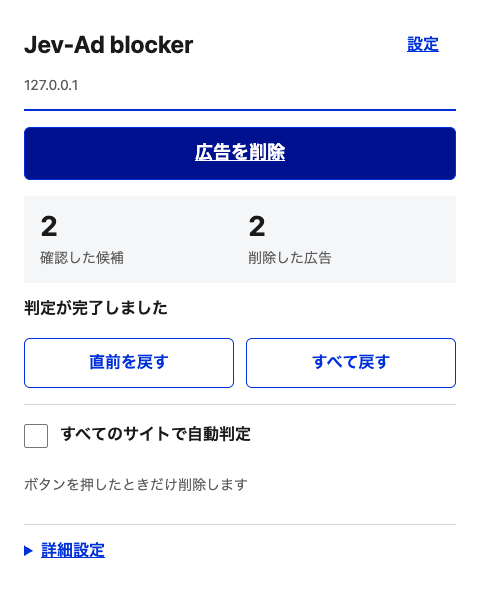

# Jev-Ad blocker

**広告をAIで見分けて、ページを読みやすく。**

Jev-Ad blockerは、ページ内の広告候補をTypeSafeのJevで判定し、表示済みの広告要素を取り除くChrome拡張です。**ZIPをダウンロード → Chromeに追加 → 自分のAPIキーを設定**すれば使い始められます。通常の導入にNode.jsやプログラミングの知識は必要ありません。

- **ページごとに判定** — 自動判定をオンにすると、アクセス・リロードのたびに広告を検出。
- **URL履歴を保存しない** — ブロックリストやサイト別設定を作らず、その場で処理。
- **判定の厳しさを調整** — 閾値は初期値80%。50〜100%を1%刻みで変更。
- **削除を取り消せる** — 直前の1件、またはすべての削除を復元。
- **自分のキーで利用** — TypeSafe直接接続、またはCloudflare AI Gatewayに対応。

> 拡張機能はMITライセンスで利用できますが、**AIの利用料金は各自のAPIアカウントに発生します**。広告の表示後に要素を削除する方式のため、通信・追跡・YouTubeなどの動画広告を遮断するものではありません。

[インストール](#インストール) · [APIキーの設定](#apiキーの設定) · [使い方](#使い方) · [困ったとき](#困ったとき) · [プライバシー](#プライバシーと権限) · [開発](#開発する方へ)

## 画面例



[設定の画面を見る](docs/images/settings.png)

画像は合成テストページでの表示です。実際のJevによる判定精度を示すものではありません。

## 必要なもの

| 項目             | 内容                                                                      |
| ---------------- | ------------------------------------------------------------------------- |
| ブラウザ         | パソコン版Google Chrome 120以上。最新の安定版を推奨                       |
| APIアカウント    | TypeSafe、またはCloudflare。自身のアカウントで有効なAPIキー・利用枠を用意 |
| ネット接続       | AIによる判定時に必要                                                      |
| 開発者向けツール | 通常の導入では不要。コード変更・テスト時のみNode.js 20以上                |

この手順はChrome Web Storeからのインストールではなく、Chromeのデベロッパーモードを使用します。会社・学校の管理端末では拡張機能の追加が制限される場合があります。スマートフォン版Chromeは対象外です。

## インストール

### 1. ZIPをダウンロードして展開する

1. [このリポジトリ](https://github.com/yuseisakai/jev-adblock)の上部にある **Code → Download ZIP** を選択します。
2. ダウンロードしたZIPを展開します。
3. 展開したフォルダを、削除・移動しない場所に置きます。必要なら、読み込む前にフォルダ名を `Jev-Ad-blocker` へ変更してください。

**選ぶのは、`manifest.json` と `src` が直接入っているフォルダです。** ZIPファイルそのものや、`src`だけを選ばないでください。

```text
Jev-Ad-blocker/        ← このフォルダをChromeに読み込む
├── manifest.json
├── src/
│   ├── background.js
│   ├── popup.html
│   └── ...
└── ...
```

[Releases](https://github.com/yuseisakai/jev-adblock/releases)に `Jev-Ad-blocker-<バージョン>.zip` が添付されている場合は、その配布用ZIPも利用できます。添付がない場合は上記のDownload ZIPを使用してください。どちらもビルド不要です。

### 2. Chromeに追加する

1. Chromeのアドレスバーに `chrome://extensions/` を入力します。
2. 右上の **デベロッパーモード** をオンにします。
3. **パッケージ化されていない拡張機能を読み込む** を押します。
4. 手順1の、`manifest.json` が入ったフォルダを選択します。
5. 一覧に **Jev-Ad blocker** が表示され、有効になっていることを確認します。
6. Chrome右上の拡張機能メニュー（パズルのアイコン）から、Jev-Ad blockerをピン留めすると開きやすくなります。

拡張機能は読み込んだフォルダを参照し続けます。導入後にフォルダを削除・移動しないでください。[Chrome公式の導入説明](https://developer.chrome.com/docs/extensions/get-started/tutorial/hello-world#load-unpacked)

## APIキーの設定

**初めての方はTypeSafe APIの直接接続が簡単です。必要な入力はAPIキー1つです。**

### TypeSafeに直接接続する

1. [TypeSafeのコンソール](https://console.typesafe.ai/)を開き、ログインします。アカウントがなければ作成します。
2. ダッシュボードから自分のAPIキーを取得し、APIの利用条件・料金・利用可能な残高や枠を確認します。[公式のAPI開始手順](https://docs.typesafe.ai/introduction/quickstart#call-it-the-api)
3. ChromeのJev-Ad blockerを開き、**設定** を押します。
4. 接続先を **TypeSafe API（直接接続）** に変更します。Cloudflareの入力欄が消えます。
5. **TypeSafe APIキー** に取得したキーを貼り付けます。
6. 外部送信・API料金の説明を読み、確認のチェックを入れます。
7. **キーを保存** を押します。
8. **接続テスト** を押し、「接続成功。Jevの判定結果を受信しました」と表示されれば設定完了です。

接続テストには架空の広告データを使います。このテストにもAPI料金が発生します。APIキーをREADME、Issue、スクリーンショットなどに載せる必要はありません。

### Cloudflare AI Gateway経由で接続する

既にCloudflareを使っている方向けの選択肢です。この経路ではTypeSafeのキーは入力しません。

1. [Cloudflareダッシュボード](https://dash.cloudflare.com/)で使用するアカウントを選択し、AI Gatewayを作成します。[Gateway作成の公式手順](https://developers.cloudflare.com/ai-gateway/get-started/)
2. アカウントの **Account ID** と、作成した **Gateway ID** を控えます。
3. そのアカウントを対象に **Account → Workers AI → Read** 権限を持つAPIトークンを作成します。AI Gatewayだけの権限では、この拡張が使用するAPIを呼び出せません。[認証の公式説明](https://developers.cloudflare.com/ai-gateway/usage/rest-api/#authentication)
4. AI Gatewayの **Unified Billing** に必要なクレジットを用意します。[課金設定の公式説明](https://developers.cloudflare.com/ai-gateway/features/unified-billing/)
5. 拡張の設定で **Cloudflare AI Gateway** を選び、Account ID・Gateway ID・APIトークンを入力します。Gateway IDの初期表示 `default` は例です。自分が作成したIDに合わせてください。
6. 外部送信・料金を確認して **キーを保存 → 接続テスト** を実行します。

### ブラウザを再起動したら

APIキーはブラウザセッション内だけに保持します。**Chromeの終了・拡張機能の再読み込み後は、キーを再入力してください。** 閾値や自動判定の設定は残ります。キー未設定の間は判定しません。

接続先を切り替えた場合も、その接続先のキーを入力して保存してください。選択肢を変更しただけでは、実際の接続先は切り替わりません。

## 使い方

### まずは1ページで試す

1. 広告のあるWebページを開きます。
2. Chrome右上からJev-Ad blockerを開きます。
3. 「このページの操作」が **広告を削除** になっていることを確認します。
4. **広告を削除** を押します。
5. 「確認した候補」「削除した広告」の件数を確認します。**詳細設定 → 判定結果** を開くと、直近の候補とモデルの推定値も確認できます。

削除せずに結果だけ確認したい場合は、**詳細設定 → 実行モード** を **判定だけ（削除しない）** に変更してからボタンを押します。手動実行は現在のページだけが対象です。再読み込み後や、後から広告が追加された場合は再度実行します。

### 毎回自動で判定する

1. **すべてのサイトで自動判定** にチェックを入れます。
2. Chromeが表示するサイトアクセスの権限要求を確認し、許可します。
3. 現在のページ、新しいページ、リロード後、遅れて追加された広告を自動で判定・削除します。

初期状態はオフです。自動判定中は削除モードになり、ログイン中のページも対象になります。機密情報を扱うときはオフにしてください。ポップアップと設定画面のチェックは同じ設定です。

チェックを外すと新しい自動判定を停止し、処理中の古い結果も破棄します。既に削除した要素は、自動では戻りません。

### 間違って消えたものを戻す

- **直前を戻す**：最後に削除した1件を戻します。
- **すべて戻す**：そのページで削除した要素をまとめて戻します。
- 復元できない場合：自動判定をオフにして、ページをリロードします。

復元した候補は同じページ内では再削除しません。リロードすると判定履歴はリセットされ、自動判定がオンなら改めて判定します。

### 閾値を変更する

ポップアップの **詳細設定** または設定画面を開き、**広告を削除する基準** に50〜100の整数を入力して **保存** を押します。設定は全サイト共通で、ポップアップと設定画面の両方に反映されます。

| 設定              | 動作の違い                                                 |
| ----------------- | ---------------------------------------------------------- |
| 80%（初期値）     | 推定値が80%以上の候補を削除                                |
| 90〜95%など高い値 | 削除する候補が少なくなり、広告が残りやすくなる             |
| 50〜70%など低い値 | 削除する候補が増え、通常の内容を誤削除するリスクも高くなる |

例えば推定値85%の候補は、閾値80%なら削除、90%なら保持します。**閾値は「正解率」ではなく、モデルの推定値に対する基準です。**

変更時は処理中の古い結果を破棄します。自動判定中はページの候補数上限の範囲で未削除の候補を再判定します。手動の場合は、もう一度「広告を削除」を押してください。閾値を上げても、削除済みの要素は自動では戻りません。

## 料金と利用上限

本拡張独自の利用料金はありません。判定・接続テストに使用するAPIの料金は、選択した提供者へ各自が支払います。単価・無料枠・利用条件は変更され得るため、[TypeSafeコンソール](https://console.typesafe.ai/)または[Cloudflareの課金説明](https://developers.cloudflare.com/ai-gateway/features/unified-billing/)で確認してください。

過剰な送信を抑えるため、1ページ50候補、1時間300要求、同時2要求、1要求10秒の上限があります。1要求には最大10候補をまとめます。手動再実行はそのページの候補枠をリセットします。ブラウザ終了で利用カウンタも消えるため、**金額ベースの厳密な課金上限ではありません。**

## 困ったとき

| 症状                                                 | 確認すること                                                                                                                      |
| ---------------------------------------------------- | --------------------------------------------------------------------------------------------------------------------------------- |
| 「マニフェストが見つかりません」などの読み込みエラー | ZIPを展開し、`manifest.json` が直接入っているフォルダを選択したか確認                                                             |
| 拡張のアイコンが見当たらない                         | Chrome右上の拡張機能メニューからJev-Ad blockerを開く。必要ならピン留め                                                            |
| 「APIキー未設定」と表示される                        | 設定でキーを保存。Chrome終了・拡張再読み込み後は再入力が必要                                                                      |
| 接続テストに失敗する                                 | 接続先とキーが一致するか、有効なキーか、利用枠・残高があるか確認。CloudflareはAccount ID・Gateway ID・Workers AI / Read権限も確認 |
| 「このページでは利用できません」                     | 通常のHTTP/HTTPSページで試す。Chrome内部ページ、Chrome Web Store、ローカルファイルなどは対象外                                    |
| 候補が0件                                            | 広告らしい属性やラベルがない、または保護対象の要素である可能性あり。全要素をAIに送る方式ではない                                  |
| 候補はあるが削除されない                             | 診断モードではないか、推定値が閾値未満ではないか確認。復元済みの候補は同じページでは再削除しない                                  |
| 自動判定されない                                     | 共通の自動判定をオンにし、Chromeのサイトアクセス許可とAPIキーを確認。エラー後はページをリロードするか手動実行                     |
| 要求上限・APIの利用制限が表示される                  | 自動判定をオフにし、時間を置いて再実行。提供元の利用状況も確認                                                                    |
| ページの必要な部分が消えた                           | 復元する。必要なら閾値を上げる。戻せない場合は自動判定をオフにしてリロード                                                        |
| 動画広告が消えない                                   | 非対応。ネットワーク通信・動画の再生処理は遮断しない                                                                              |

解決しない場合は [Issue](https://github.com/yuseisakai/jev-adblock/issues) に、拡張・Chrome・OSのバージョンと再現手順を記載してください。APIキーや機密ページの情報は貼らないでください。脆弱性の報告は [SECURITY.md](SECURITY.md) を確認してください。

## プライバシーと権限

| 情報                                                      | 扱い                                                     |
| --------------------------------------------------------- | -------------------------------------------------------- |
| 共通閾値、自動判定、接続先、Cloudflare接続ID              | ブラウザ内にローカル保存                                 |
| APIキー、利用カウンタ、一時的なタブID・文書ID・手動モード | ブラウザセッション内のみ。ページ側からキーを参照できない |
| 閲覧URL、ブロックしたURL、サイト別設定                    | 保存しない                                               |
| 判定結果・復元用の要素                                    | 対象ページ内のメモリだけ。リロード等で破棄               |

APIへ送るのは候補テキスト（最大500文字）、広告ラベル、要素種別・寸法、広告属性の有無、リンク／iframeのホストです。フォーム値は抽出せず、CSS非表示テキスト、URL表記、メールアドレスは可能な範囲で除外・マスクします。**完全な匿名化は保証されません。** 氏名・住所・電話番号などが候補内に残る可能性があります。

手動実行では現在のタブへの一時的な権限、自動判定ではHTTP/HTTPS全サイトへの任意権限を使用します。独自のサーバー、アクセス解析、Chrome Syncへの保存はありません。API提供者側のデータ処理は各社の条件に従います。詳しくは [PRIVACY.md](PRIVACY.md)。

## 更新・アンインストール

**更新**：自動判定をオフにし、新版を取得して、最初に読み込んだフォルダの内容を新版へ置き換えます。`chrome://extensions/` でJev-Ad blockerの再読み込みボタンを押し、キーを再入力します。同じフォルダのパスを使うと設定を引き継ぎやすくなります。新しい別フォルダを追加すると、別の拡張として扱われる場合があります。

0.5.xから0.6.0への更新では旧サイト別設定と旧サイト権限を削除し、共通閾値80%へ移行します。自動判定のオン／オフと接続IDは保持します。以降の更新で共通閾値を一律に上書きすることはありません。

**アンインストール**：`chrome://extensions/` でJev-Ad blockerの「削除」を選びます。その後、保存したフォルダも不要なら削除できます。拡張の削除だけでは、APIアカウントの解約やキーの失効は行われません。

## 仕組みと制限

```text
ページを開く／手動で実行
  → 広告らしい候補を抽出（最大50件）
  → 選んだAPIに構造化した判定要求（最大10候補ずつ）
  → 推定値・ページ・候補・設定の変更有無を検証
  → 閾値以上の要素を削除し、ページ内に復元用データを保持
```

- 記事・フォーム・大きな要素などは保護します。保守的な設計のため、`article`内の広告や`article`で作られたスポンサー枠も見逃します。保護対象外の通常コンテンツの誤削除はあり得ます。
- Shadow DOM内部、クロスオリジンiframe内部は読みません。iframe外側は候補になります。
- 広告が読み込まれた後の処理なので、一瞬表示されたり、通信・追跡が先に発生したりすることがあります。
- API失敗や不正な結果では新たな削除を行いません。自動送信は停止し、リロードまたは手動実行で再開します。
- 復元用に最大5000要素を保持します。親要素の削除やページ遷移で復元できなくなる場合があります。

TypeSafe直接接続は `api.typesafe.ai/v1/systemone` の `jev-latest`、Cloudflareは `api.cloudflare.com/client/v4/accounts/{account_id}/ai/run` の `typesafe/jev` を使用します。キーは接続先と組で扱い、失敗時に別の接続先へ転送しません。CloudflareのGatewayログ・キャッシュは要求単位で無効化します。

## 開発する方へ

通常の利用は上記のZIP導入だけで完了します。コードを変更・テストする場合はNode.js 20以上を使用してください。

```sh
git clone https://github.com/yuseisakai/jev-adblock.git
cd jev-adblock
npm ci
npm run build
npm test
npx playwright install chromium
npm run test:e2e
```

開発時は生成された `dist/` をChromeへ読み込むと、配布物と同じ構成で確認できます。リポジトリ直下の `manifest.json` も同じ `src/` を指すため、Download ZIPからの導入ではビルド不要です。

E2Eは合成ページとモックAIを使用します。実APIキー不要で、実Jevの精度・実認証・Chromeのネイティブ権限ダイアログは検証しません。[検証範囲](docs/verification.md)

- `npm run format` / `npm run format:check`：書式の整形・確認。
- `npm run test:site`：公開中のiPhone Maniaを使う任意検証。AIはモックですがWeb接続します。CI対象外。
- `npm run package`：Python 3も使用して、`releases/` に配布ZIPとSHA-256を生成。利用者にはPython不要。

参加方法は [CONTRIBUTING.md](CONTRIBUTING.md)、リリース手順は [docs/releasing.md](docs/releasing.md)。

## ライセンス・参考資料

**MIT License** — [LICENSE](LICENSE)。利用・改変・再配布はライセンスの条件に従って行えます。APIサービスの利用条件・料金や商標の許諾は別です。

[realZachi/typesafe-adblock](https://github.com/realZachi/typesafe-adblock)の構成・API利用方法を参考にした個人プロジェクトです。UIは[デジタル庁デザインシステム](https://design.digital.go.jp/dads/)の指針を参照しています。TypeSafe・Cloudflare・デジタル庁による提供・認定ではありません。

[第三者への帰属表記](THIRD_PARTY_NOTICES.md) · [デザイン方針](docs/design.md) · [変更履歴](CHANGELOG.md)
